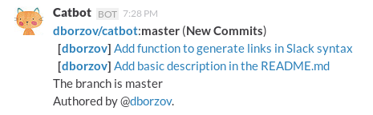

# catbot
A minimalist Slack bot/integration for Github Webhook Notifications.

`catbot` is an implementation of Github integration for the Slack chat. That is, it posts chat messages notifying of events like pull requests, new commit pushes and so on:



The notifications are received and cofigured via [Github webhooks](https://developer.github.com/webhooks/).

### Comparison to the default Slack Github integration
There is a "stock" Github integration in the Slack defaults that does the same thing. So why would anyone use `catbot`?

What bothered us about the default integration is that it required [read/write authorization](https://slack.zendesk.com/hc/en-us/articles/201824286-Setting-up-the-GitHub-integration) to ALL the user's repositories.

That is a lot to ask, especially taking into account that
- Github's authorization permission levels are fine-grained enough to include a read/write access to  notifications&webhooks only. Thus this authorization request is not motivated by necessity.
- Setting up and configuring the notifications via Github Webhooks (within the settings section of specific repos) is more transparent and makes more sense
- Slack has history of huge security breaches and manifests all the traits of the valley startup in the growth phase so unexpected changes (being bought, intensified monetization, going bust) are likely
- Complete freedom of the message formatting

### Install & setup
`catbot` is a small program that should be run in a daemon/server mode which listens for Github Webhook notifications on `0.0.0.0:5000/` and then posts things through Slack's webhook integration.

Set up secrets as the environment variables:
```sh
export GITHUB_SECRET="secret you used to set up your github integration"

export SLACK_HOOK="https://slack.integration.endpoint"
```

Now add Github Webhooks to the repos you want using the port `http://catbotServer:5000`.

You are all set!

### Credits
`catbot` has been forged at [datacats](datacats.com), provider of open data portal solutions that ♥ open source.
